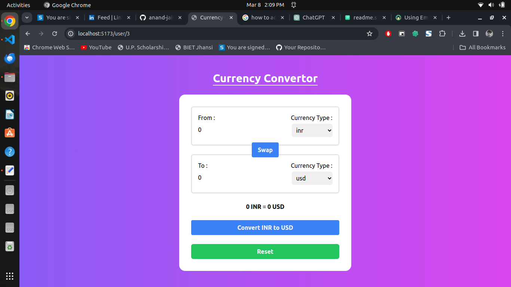

# Currency Converter App

This is a simple currency converter app built using React and custom hooks. The app utilizes an API to fetch data about different currencies from around the world, allowing users to convert between various currencies.

## Screenshot


## Features

- Convert between different currencies using real-time exchange rates.
- User-friendly interface for easy currency conversion.
- Built with React and custom hooks for efficient state management.
- Utilizes an API to fetch currency data from around the world.

## API Used 

Change currency variable accordingly. For example usd for Doller and inr for Indian Rupee.

```
https://cdn.jsdelivr.net/npm/@fawazahmed0/currency-api@latest/v1/currencies/${currency}.json

```

## Getting Started

To get started with this project, follow these steps:

1. Clone the repository:

```bash
git clone https://github.com/anand-jaiswal-IN/currency-converter-app.git
```

2. Navigate to the project directory:

```bash
cd currency-converter-app
```

3. Install dependencies:

```bash
npm install
```

4. Start the development server:

```bash
npm run dev
```

5. Open your browser and visit [http://localhost:3000](http://localhost:3000) to view the app.

## Usage

- Select the currency you want to convert from and to.
- Enter the amount you want to convert.
- The app will display the converted amount based on real-time exchange rates.

## Technologies Used

- Vite
- React
- Custom Hooks
- API for currency data
- Tailwind classes

## Folder Structure

```
currency-converter-app/
│
├── index.html
│
├── src/
│   ├── components/
│   │   ├── CurrencyTextBox.jsx
│   │   └── ...
│   ├── hooks/
│   │   ├── useCurrencyInfo.js
│   │   └── ...
│   ├── App.jsx
│   └── index.js
│
├── .gitignore
├── package.json
├── README.md
└── ...
```

## Contributing

Contributions are welcome! Feel free to open an issue or submit a pull request.

## Thanks

Thankyou for visiting my repository to check my project. Feel free to explore more project on my Github. Your support are required to push myself. ❤️
